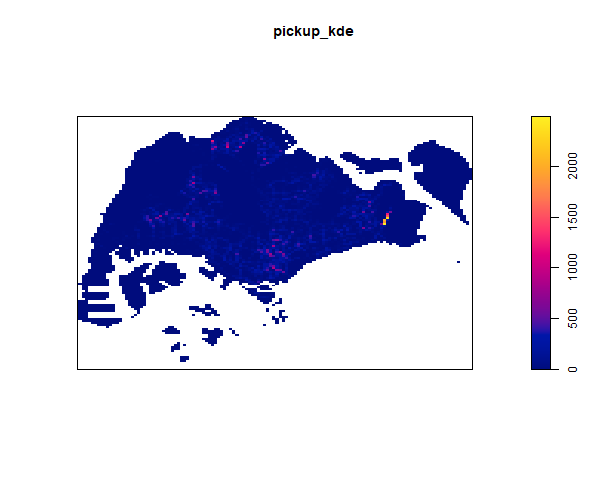
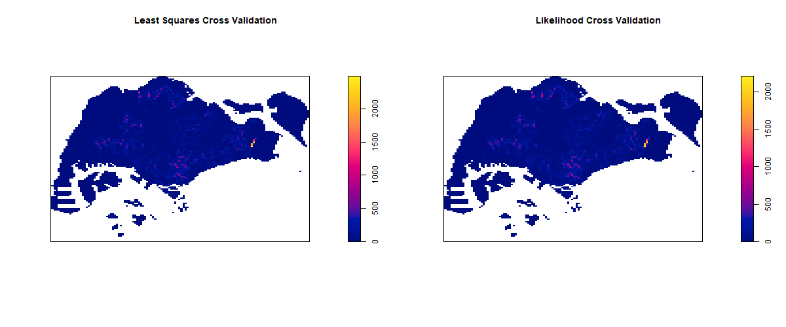
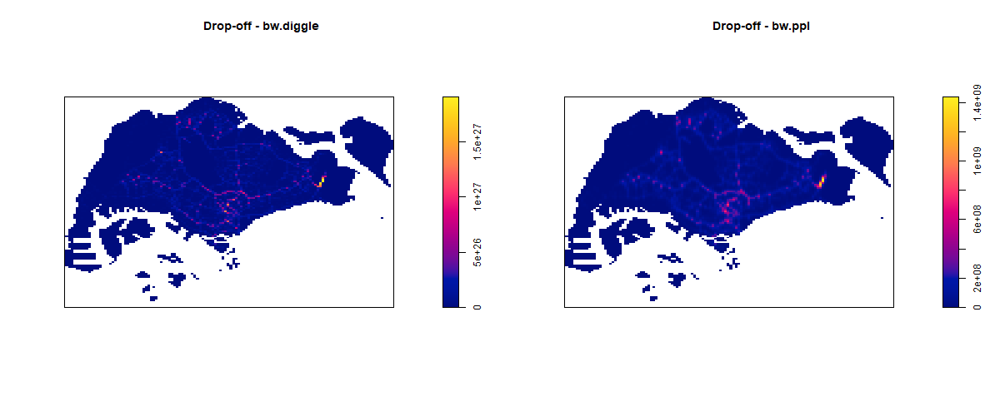
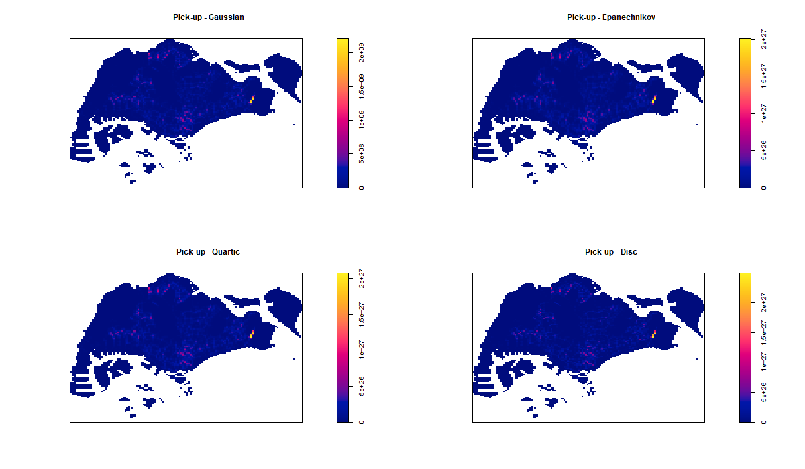
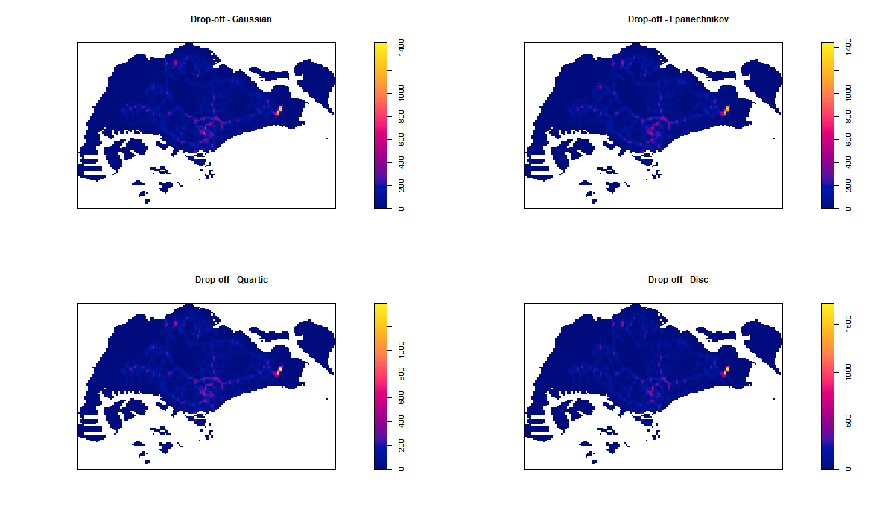
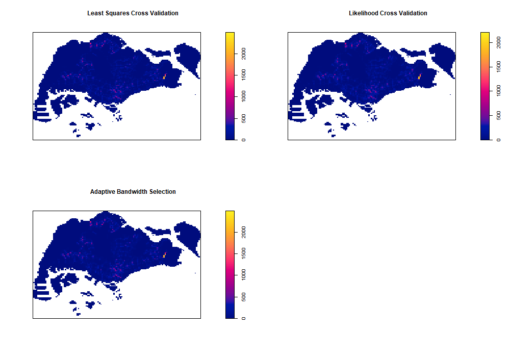
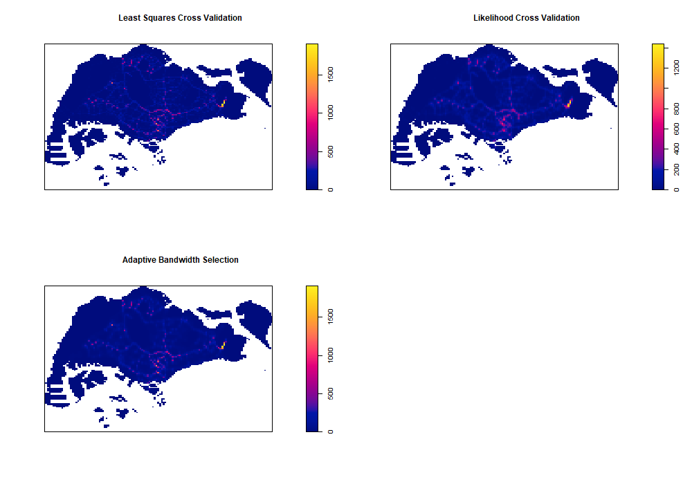

{width="500"}

# Getting Started

The code chunk below uses `p_load()` function of pacman package to check if the required packages have been installed on the computer. If they are, the packages will be launched.

The packages used are:

-   sf package is used for importing, managing, and processing geospatial data.
-   tidyverse package for aspatial data wrangling.
-   spatstat package to perform 1st-order spatial point patterns analysis and derive kernel density estimation (KDE) layer.
-   tmap package is used to visualize geospatial data on maps.

```{r}
pacman::p_load(sf, tidyverse, spatstat, tmap)
```

In the code chunk below, the [cleaned data files](DataPrep.qmd) are loaded into R.

```{r}
# Load base map
mpsz = st_read(dsn = "../data/geospatial", 
               layer = "MPSZ-2019") %>%
  st_transform(crs = 3414)

# Load rds file
pickup_sf <- st_as_sf(read_rds("../data/rds/pickup_sf.rds"))
dropoff_sf <- st_as_sf(read_rds("../data/rds/dropoff_sf.rds"))
```

# Convert Pickup and Dropoff location sf dataframes into spatstat’s ppp object format

Convert the sf dataframe to a ppp object using `as.ppp()` function from the spatstat package. The result is a marked planar point pattern. To change a marked planar point pattern to just a planar point pattern, simply remove the marks associated with each point using `marks(pickup_ppp) <- NULL`.

```{r}
pickup_ppp <- as.ppp(pickup_sf)
marks(pickup_ppp) <- NULL

plot(pickup_ppp)
```

```{r}
dropoff_ppp <- as.ppp(dropoff_sf)
marks(dropoff_ppp) <- NULL

plot(dropoff_ppp)
```

# Create observational window (owin)

When analysing spatial point patterns, it is a good practice to confine the analysis with a geographical area like Singapore boundary. In spatstat, an object called owin is specially designed to represent this polygonal region. The code chunk below is used to create a border of Singapore's land area and convert it into an owin object of spatstat package using `as.owin()`.

```{r}
# Create border of Singapore's land area
mpsz_border <- st_cast(mpsz %>%
                         summarize(), "POLYGON")

# Convert the resulting sf object to an owin object
mpsz_owin <- as.owin(mpsz_border)

plot(mpsz_owin)
```

# Combine point events object and owin object

In the code chunks below, pick-up and drop-off events located within the observational window are extracted.

```{r}
pickup_owin = pickup_ppp[mpsz_owin]

plot(pickup_owin)
```

```{r}
dropoff_owin = dropoff_ppp[mpsz_owin]

plot(dropoff_owin)
```

# KDE Analysis using automatic bandwidth selection method and Gaussian smoothing kernel

The code chunk below computes a kernel density by using the following configurations of `density()` function of spatstat:

-   `bw.diggle()` automatic bandwidth selection method. Other recommended methods are `bw.CvL()`, `bw.scott()` or `bw.ppl()`.
-   Gaussian smoothing kernel, which is the default. Other smoothing methods are: `epanechnikov`, `quartic` or `disc`.
-   The intensity estimate is corrected for edge effect bias i.e. `edge=TRUE` (default is `FALSE`).

`rescale()` function is used to covert the unit of measurement from meter to kilometer.

```{r}
#| eval: false
pickup_owin <- rescale(pickup_owin, 1000, "km")
pickup_kde <- density(pickup_owin, sigma=bw.diggle, edge=TRUE, kernel="gaussian") 

dropoff_owin <- rescale(dropoff_owin, 1000, "km")
dropoff_kde <- density(dropoff_owin, sigma=bw.diggle, edge=TRUE, kernel="gaussian")

png("pickup_kde.png", width=600, height=500)
plot(pickup_kde)

png("dropoff_kde.png", width=600, height=500)
plot(dropoff_kde)
```




# Working with different automatic bandwidth methods

`bw.diggle()` refers to a cross-validated bandwidth selection while `bw.ppl()` refers to a likelihood cross-validated bandwidth selection. Baddeley et. (2016) suggested the use of the `bw.ppl()` algorithm because in their experience it tends to produce the more appropriate values when the pattern consists predominantly of tight clusters. But they also insist that if the purpose of once study is to detect a single tight cluster in the midst of random noise then the `bw.diggle()` method seems to work best.

-   In pick-up locations, both methods do not seem to produce much visible difference.
-   In drop-off locations, slightly more intense clusters seem to be detected using `bw.diggle()`.

```{r}
#| eval: false
pickup_ppl <- density(pickup_owin, sigma=bw.ppl, edge=TRUE, kernel="gaussian")
dropoff_ppl <- density(dropoff_owin, sigma=bw.ppl, edge=TRUE, kernel="gaussian")

par(mfrow=c(2,2))

png("pickup_auto.png", width=1200, height=500)
par(mfrow=c(1,2))
plot(pickup_kde, main="Pick-up - bw.diggle")
plot(pickup_ppl, main="Pick-up - bw.ppl")

png("dropoff_auto.png", width=1200, height=500)
par(mfrow=c(1,2))
plot(dropoff_kde, main="Drop-off - bw.diggle")
plot(dropoff_ppl, main="Drop-off - bw.ppl")
```





# Working with different kernel methods

```{r}
#| eval: false
pickup_ep <- density(pickup_owin, sigma=bw.ppl, edge=TRUE, kernel="epanechnikov")
pickup_q <- density(pickup_owin, sigma=bw.ppl, edge=TRUE, kernel="quartic")
pickup_d <- density(pickup_owin, sigma=bw.ppl, edge=TRUE, kernel="disc")

png("pickup_kernels.png", width=1200, height=700)
par(mfrow=c(2,2))
plot(pickup_ppl, main="Pick-up - Gaussian")
plot(pickup_ep, main="Pick-up - Epanechnikov")
plot(pickup_q, main="Pick-up - Quartic")
plot(pickup_d, main="Pick-up - Disc")
```



```{r}
#| eval: false
dropoff_ep <- density(dropoff_owin, sigma=bw.ppl, edge=TRUE, kernel="epanechnikov")
dropoff_q <- density(dropoff_owin, sigma=bw.ppl, edge=TRUE, kernel="quartic")
dropoff_d <- density(dropoff_owin, sigma=bw.ppl, edge=TRUE, kernel="disc")

png("dropoff_kernels.png", width=1200, height=700)
par(mfrow=c(2,2))
plot(dropoff_ppl, main="Drop-off - Gaussian")
plot(dropoff_ep, main="Drop-off - Epanechnikov")
plot(dropoff_q, main="Drop-off - Quartic")
plot(dropoff_d, main="Drop-off - Disc")
```



# KDE Analysis using adaptive bandwidth

Fixed bandwidth method is very sensitive to highly skew distribution of spatial point patterns over geographical units for example urban versus rural. One way to overcome this problem is by using adaptive bandwidth - in spatstat package, this can be derived using `density.adaptive()` function.

```{r}
#| eval: false
pickup_adapt <- adaptive.density(pickup_owin, method="kernel")
dropoff_adapt <- adaptive.density(dropoff_owin, method="kernel")

png("pickup_adapt.png", width=1200, height=700)
par(mfrow=c(1,2))
plot(pickup_ppl, main="Pick-up - Automatic Bandwidth Selection")
plot(pickup_adapt, main="Pick-up - Adaptive Bandwidth Selection")

png("dropoff_adapt.png", width=1200, height=700)
par(mfrow=c(1,2))
plot(dropoff_ppl, main="Drop-off - Automatic Bandwidth Selection")
plot(dropoff_adapt, main="Drop-off - Adaptive Bandwidth Selection")
```




